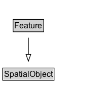

# Feature

NOTE: A Feature represents a uniquely identifiable phenomenon, for example a river or an apple. While such phenomena (and therefore the Features used to represent them) are bounded, their boundaries may be crisp (e.g., the declared boundaries of a state), vague (e.g., the delineation of a valley versus its neighboring mountains), and change with time (e.g., a storm front). While discrete in nature, Features may be created from continuous observations, such as an isochrone that determines the region that can be reached by ambulance within 5 minutes.

## Diagram

=== "SVG (interactive)"

    <!-- Generated by graphviz version 14.1.3 (20260303.0454)
     -->
    <!-- Pages: 1 -->
    <svg width="161pt" height="132pt"
     viewBox="0.00 0.00 161.00 132.00" xmlns="http://www.w3.org/2000/svg" xmlns:xlink="http://www.w3.org/1999/xlink">
    <g id="graph0" class="graph" transform="scale(1 1) rotate(0) translate(4 128)">
    <polygon fill="white" stroke="none" points="-4,4 -4,-128 157,-128 157,4 -4,4"/>
    <g id="clust2" class="cluster">
    <title>cluster_associated</title>
    </g>
    <!-- Feature -->
    <g id="node1" class="node">
    <title>Feature</title>
    <g id="a_node1"><a xlink:href="../Feature" xlink:title="&lt;TABLE&gt;">
    <polygon fill="lightgray" stroke="none" points="16.38,-81.88 16.38,-98.12 59.62,-98.12 59.62,-81.88 16.38,-81.88"/>
    <text xml:space="preserve" text-anchor="start" x="17.38" y="-85.88" font-family="Arial" font-size="12.00">Feature</text>
    <polygon fill="none" stroke="black" points="15.38,-80.88 15.38,-99.12 60.62,-99.12 60.62,-80.88 15.38,-80.88"/>
    </a>
    </g>
    </g>
    <!-- SpatialObject -->
    <g id="node3" class="node">
    <title>SpatialObject</title>
    <g id="a_node3"><a xlink:href="../SpatialObject" xlink:title="&lt;TABLE&gt;">
    <polygon fill="lightgray" stroke="none" points="1,-9.88 1,-26.12 75,-26.12 75,-9.88 1,-9.88"/>
    <text xml:space="preserve" text-anchor="start" x="2" y="-13.88" font-family="Arial" font-size="12.00">SpatialObject</text>
    <polygon fill="none" stroke="black" points="0,-8.88 0,-27.12 76,-27.12 76,-8.88 0,-8.88"/>
    </a>
    </g>
    </g>
    <!-- Feature&#45;&gt;SpatialObject -->
    <g id="edge1" class="edge">
    <title>Feature&#45;&gt;SpatialObject</title>
    <path fill="none" stroke="black" d="M38,-72.05C38,-64.57 38,-55.58 38,-47.14"/>
    <polygon fill="none" stroke="black" points="41.5,-47.3 38,-37.3 34.5,-47.3 41.5,-47.3"/>
    </g>
    <!-- Invis -->
    </g>
    </svg>

=== "PNG"

    

## Formalization for Feature

| Property | Constraint |
|----------|------------|
| disjointWith | [Geometry](Geometry.md) |
| subClassOf | [SpatialObject](SpatialObject.md) |

## Used by classes

| Class | Property |
|-------|----------|
| [Feature Collection (rdfs)](FeatureCollection.md) | [rdfs:member](https://w3id.org/citydata/imported/rdfs/member) |

## Other annotations

| Property | Value |
|----------|-------|
| [schema:description](https://w3id.org/citydata/imported/schema/description) | A discrete spatial phenomenon in a universe of discourse. |
| [schema:name](https://w3id.org/citydata/imported/schema/name) | Feature |

