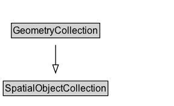

# GeometryCollection

## Diagram

=== "SVG (interactive)"

    <!-- Generated by graphviz version 14.1.3 (20260303.0454)
     -->
    <!-- Pages: 1 -->
    <svg width="216pt" height="132pt"
     viewBox="0.00 0.00 216.00 132.00" xmlns="http://www.w3.org/2000/svg" xmlns:xlink="http://www.w3.org/1999/xlink">
    <g id="graph0" class="graph" transform="scale(1 1) rotate(0) translate(4 128)">
    <polygon fill="white" stroke="none" points="-4,4 -4,-128 212,-128 212,4 -4,4"/>
    <g id="clust2" class="cluster">
    <title>cluster_associated</title>
    </g>
    <!-- GeometryCollection -->
    <g id="node1" class="node">
    <title>GeometryCollection</title>
    <g id="a_node1"><a xlink:href="../GeometryCollection" xlink:title="&lt;TABLE&gt;">
    <polygon fill="lightgray" stroke="none" points="11.12,-81.88 11.12,-98.12 118.88,-98.12 118.88,-81.88 11.12,-81.88"/>
    <text xml:space="preserve" text-anchor="start" x="12.12" y="-85.88" font-family="Arial" font-size="12.00">GeometryCollection</text>
    <polygon fill="none" stroke="black" points="10.12,-80.88 10.12,-99.12 119.88,-99.12 119.88,-80.88 10.12,-80.88"/>
    </a>
    </g>
    </g>
    <!-- SpatialObjectCollection -->
    <g id="node3" class="node">
    <title>SpatialObjectCollection</title>
    <g id="a_node3"><a xlink:href="../SpatialObjectCollection" xlink:title="&lt;TABLE&gt;">
    <polygon fill="lightgray" stroke="none" points="1,-9.88 1,-26.12 129,-26.12 129,-9.88 1,-9.88"/>
    <text xml:space="preserve" text-anchor="start" x="2" y="-13.88" font-family="Arial" font-size="12.00">SpatialObjectCollection</text>
    <polygon fill="none" stroke="black" points="0,-8.88 0,-27.12 130,-27.12 130,-8.88 0,-8.88"/>
    </a>
    </g>
    </g>
    <!-- GeometryCollection&#45;&gt;SpatialObjectCollection -->
    <g id="edge1" class="edge">
    <title>GeometryCollection&#45;&gt;SpatialObjectCollection</title>
    <path fill="none" stroke="black" d="M65,-72.05C65,-64.57 65,-55.58 65,-47.14"/>
    <polygon fill="none" stroke="black" points="68.5,-47.3 65,-37.3 61.5,-47.3 68.5,-47.3"/>
    </g>
    <!-- Invis -->
    </g>
    </svg>

=== "PNG"

    

## Formalization for GeometryCollection

| Property | Constraint |
|----------|------------|
| [rdfs:member](https://w3id.org/citydata/imported/rdfs/member) | only [Geometry](Geometry.md) |
| subClassOf | [SpatialObjectCollection](SpatialObjectCollection.md) |

## Other annotations

| Property | Value |
|----------|-------|
| [schema:description](https://w3id.org/citydata/imported/schema/description) | A collection of individual Geometries. |
| [schema:name](https://w3id.org/citydata/imported/schema/name) | Geometry Collection |

