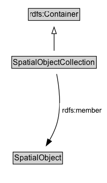

# SpatialObjectCollection

A collection of individual Spatial Objects.

NOTE: This is the superclass of Feature Collection and Geometry Collection.

## Diagram

=== "SVG (interactive)"

    <!-- Generated by graphviz version 14.1.3 (20260303.0454)
     -->
    <!-- Pages: 1 -->
    <svg width="164pt" height="279pt"
     viewBox="0.00 0.00 164.00 279.00" xmlns="http://www.w3.org/2000/svg" xmlns:xlink="http://www.w3.org/1999/xlink">
    <g id="graph0" class="graph" transform="scale(1 1) rotate(0) translate(4 275)">
    <polygon fill="white" stroke="none" points="-4,4 -4,-275 160.21,-275 160.21,4 -4,4"/>
    <g id="clust3" class="cluster">
    <title>cluster_associated</title>
    </g>
    <!-- rdfs_Container -->
    <g id="node1" class="node">
    <title>rdfs_Container</title>
    <g id="a_node1"><a xlink:href="https://w3id.org/citydata/imported/rdfs/latest/Container" xlink:title="&lt;TABLE&gt;">
    <polygon fill="lightgray" stroke="none" points="40.5,-244.88 40.5,-261.12 117.5,-261.12 117.5,-244.88 40.5,-244.88"/>
    <text xml:space="preserve" text-anchor="start" x="41.5" y="-248.88" font-family="Arial" font-size="12.00">rdfs:Container</text>
    <polygon fill="none" stroke="black" points="39.5,-243.88 39.5,-262.12 118.5,-262.12 118.5,-243.88 39.5,-243.88"/>
    </a>
    </g>
    </g>
    <!-- SpatialObjectCollection -->
    <g id="node2" class="node">
    <title>SpatialObjectCollection</title>
    <g id="a_node2"><a xlink:href="../SpatialObjectCollection" xlink:title="&lt;TABLE&gt;">
    <polygon fill="lightgray" stroke="none" points="15,-171.88 15,-188.12 143,-188.12 143,-171.88 15,-171.88"/>
    <text xml:space="preserve" text-anchor="start" x="16" y="-175.88" font-family="Arial" font-size="12.00">SpatialObjectCollection</text>
    <polygon fill="none" stroke="black" points="14,-170.88 14,-189.12 144,-189.12 144,-170.88 14,-170.88"/>
    </a>
    </g>
    </g>
    <!-- SpatialObjectCollection&#45;&gt;rdfs_Container -->
    <g id="edge1" class="edge">
    <title>SpatialObjectCollection&#45;&gt;rdfs_Container</title>
    <path fill="none" stroke="black" d="M79,-197.71C79,-205.47 79,-214.92 79,-223.74"/>
    <polygon fill="none" stroke="black" points="75.5,-223.66 79,-233.66 82.5,-223.66 75.5,-223.66"/>
    </g>
    <!-- Invis -->
    <!-- SpatialObjectCollection&#45;&gt;Invis -->
    <!-- SpatialObject -->
    <g id="node4" class="node">
    <title>SpatialObject</title>
    <g id="a_node4"><a xlink:href="../SpatialObject" xlink:title="&lt;TABLE&gt;">
    <polygon fill="lightgray" stroke="none" points="17,-25.88 17,-42.12 91,-42.12 91,-25.88 17,-25.88"/>
    <text xml:space="preserve" text-anchor="start" x="18" y="-29.88" font-family="Arial" font-size="12.00">SpatialObject</text>
    <polygon fill="none" stroke="black" points="16,-24.88 16,-43.12 92,-43.12 92,-24.88 16,-24.88"/>
    </a>
    </g>
    </g>
    <!-- SpatialObjectCollection&#45;&gt;SpatialObject -->
    <g id="edge4" class="edge">
    <title>SpatialObjectCollection&#45;&gt;SpatialObject</title>
    <path fill="none" stroke="black" d="M82.97,-162.11C86.58,-143.79 90.44,-113.84 84,-89 81.51,-79.41 76.91,-69.7 72.05,-61.21"/>
    <polygon fill="black" stroke="black" points="75.12,-59.53 66.9,-52.85 69.16,-63.2 75.12,-59.53"/>
    <polygon fill="white" stroke="none" points="87.46,-96.25 87.46,-117.75 156.21,-117.75 156.21,-96.25 87.46,-96.25"/>
    <text xml:space="preserve" text-anchor="start" x="91.46" y="-103.25" font-family="Arial" font-size="11.00">rdfs:member</text>
    </g>
    <!-- Invis&#45;&gt;SpatialObject -->
    </g>
    </svg>

=== "PNG"

    

## Specializations of SpatialObjectCollection

| Class | Description |
|-------|-------------|
| [Feature Collection](FeatureCollection.md) | A collection of individual Features. |
| [Geometry Collection](GeometryCollection.md) | A collection of individual Geometries. |

## Formalization for SpatialObjectCollection

| Property | Constraint |
|----------|------------|
| [rdfs:member](https://w3id.org/citydata/imported/rdfs/member) | only [SpatialObject](SpatialObject.md) |
| subClassOf | [rdfs:Container](https://w3id.org/citydata/imported/rdfs/Container) |

